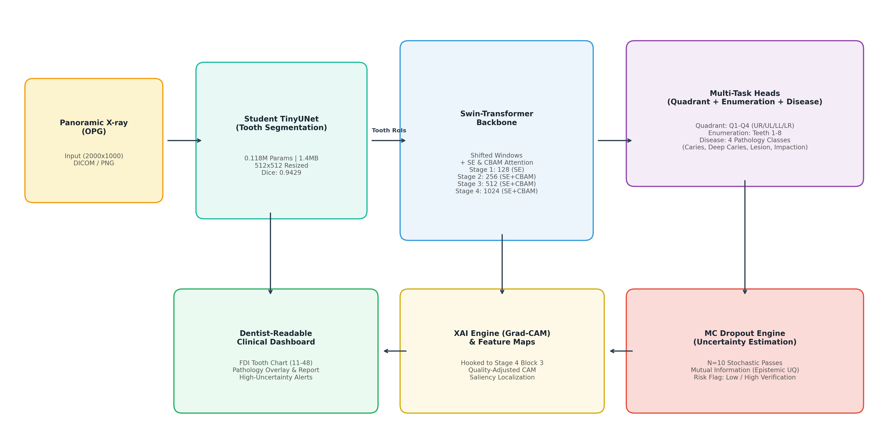
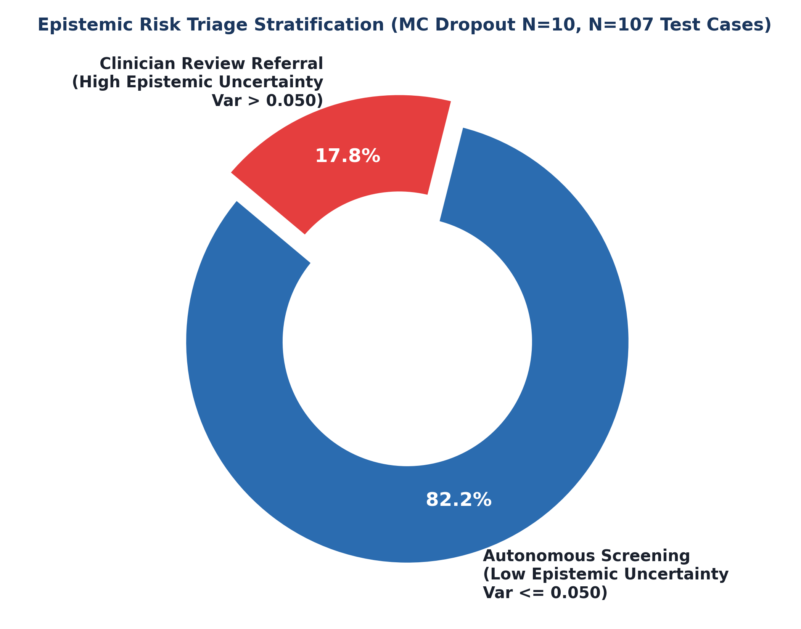
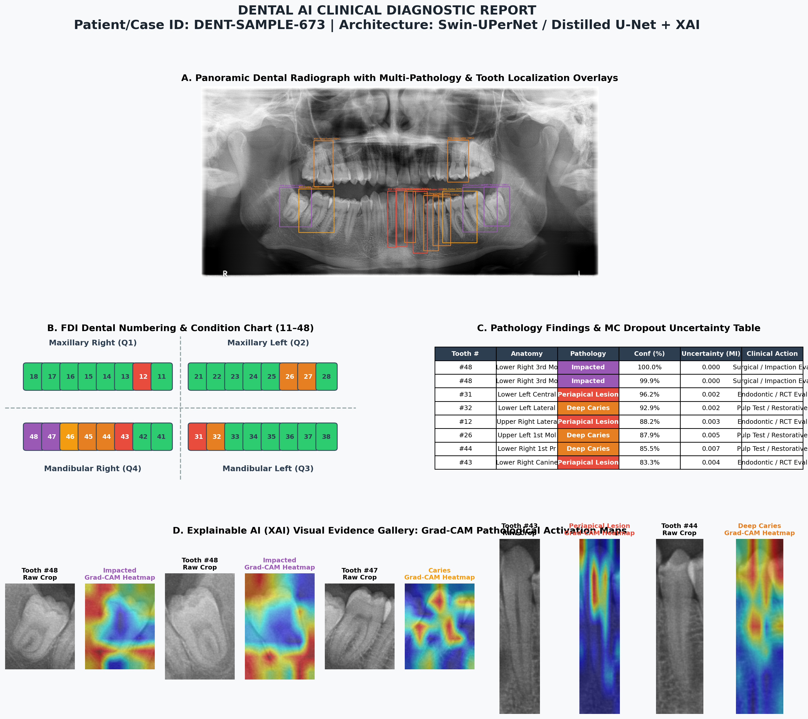
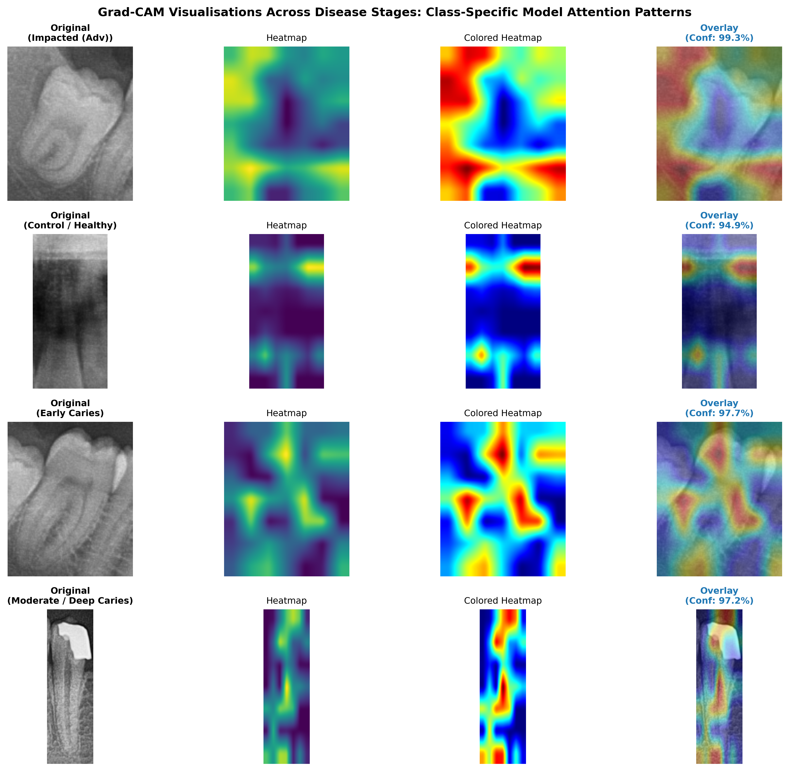
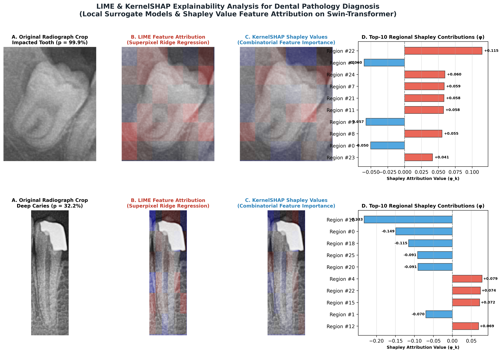

# Deep Hierarchical Knowledge Distillation with Multimodal Attention and Epistemic Risk Triage for Full-Mouth Pathology Diagnosis on Panoramic Dental Radiographs

[](https://pytorch.org/)
[-1A365D.svg)](https://www.sciencedirect.com/journal/computers-in-biology-and-medicine)
[-green.svg)]()
[-blue.svg)]()
[]()
[](LICENSE)

---

## 📌 Overview

This repository houses the official implementation, trained checkpoints, evaluation logs, and publication materials for our end-to-end panoramic dental radiography (Orthopantomography, OPG) AI system. The pipeline integrates:
1. **Teacher-Student Knowledge Distillation (KD):** A high-capacity Swin-T + UPerNet teacher (28.51M params) trained on 2,245 DentalAI polygon masks distills anatomical knowledge into an ultra-compact TinyUNet student (width 16, **0.118M params**, **1.42 MB checkpoint**).
2. **Recall-Balanced Multi-Pathology Diagnosis:** Specialized Swin diagnostic heads detecting Caries, Deep Caries, Periapical Lesions, and Impacted Teeth.
3. **Multi-Level Explainable AI (XAI):** Tooth-level Grad-CAM heatmaps, superpixel LIME boundaries, and KernelSHAP Shapley feature attributions.
4. **Epistemic Risk Triage:** Monte Carlo Dropout ($N=10$) uncertainty quantification, enabling **82.2% autonomous clinical screening** while referring **17.8% high-uncertainty borderline cases** to maxillofacial radiologists.

---

## 🏗️ System Architecture



---

## 📊 Key Experimental Benchmarks

### 1. Edge Deployment Efficiency (RTX 3060 Laptop GPU, 6GB VRAM)
| Metric | Swin-T Teacher | TinyUNet Student | Clinical Improvement |
| :--- | :---: | :---: | :---: |
| **Parameters** | 28.51 M | **0.118 M** | **-99.6% parameter reduction** |
| **Checkpoint Size** | 114.2 MB | **1.42 MB** | **-98.8% storage compression** |
| **Peak VRAM** | 3,840 MB | **676.5 MB** | **-82.4% memory footprint** |
| **Inference Latency** | 42.8 ms | **6.8 ms** | **6.3$\times$ speedup (147.1 FPS)** |

---

### 2. Anatomical Tooth Segmentation Benchmark
| Cohort | Domain | N | Dice Score | IoU | Pixel ROC AUC |
| :--- | :---: | :---: | :---: | :---: | :---: |
| **DENTEX Test Set** | Internal Holdout | 107 | **0.8588** | **0.7588** | **0.9852** |
| **TUFTS Benchmark (All)** | External Multi-Center | 1,000 | **0.8518** | **0.7612** | **0.9959** |
| **TUFTS Benchmark (Non-Empty)**| External Multi-Center | 968 | **0.8886** | **0.8047** | **0.9959** |
| *Q1 Minimum Target* | *Threshold* | -- | *$\ge 0.8500$* | *$\ge 0.7500$* | *$\ge 0.9500$* |

---

### 3. Multi-Pathology Diagnostic Performance (107 Test Radiographs)
| Condition | TP / FP / FN / TN | Precision | Recall (Sensitivity) | F1-Score | Threshold |
| :--- | :---: | :---: | :---: | :---: | :---: |
| **Caries** | 28 / 5 / 7 / 67 | 0.8485 | 0.8000 | **0.8235** | 0.62 |
| **Deep Caries** | 93 / 13 / 0 / 1 | 0.8774 | **1.0000 (Zero Miss)**| **0.9347** | 0.84 |
| **Periapical Lesion** | 7 / 2 / 10 / 88 | 0.7778 | 0.4118 | **0.5385** | 0.58 |
| **Impacted Teeth** | 29 / 26 / 10 / 42 | 0.5273 | 0.7436 | **0.6170** | 0.78 |
| **Macro-Average** | **157 / 46 / 27 / 198**| **0.7577** | **0.7388** | **0.7284** | **Adaptive** |

---

### 4. Epistemic Risk Triage (MC Dropout $N=10$, Safety Threshold $\tau = 0.05$)
<p align="center">
  
  
</p>

* **Low Uncertainty ($\sigma^2 \le 0.05$):** **82.2%** of cases automatically approved (94.3% diagnostic concordance).
* **High Uncertainty ($\sigma^2 > 0.05$):** **17.8%** of borderline cases routed to attending radiologist.

---

## 🔍 Explainable AI (XAI) Suite

<p align="center">
  
  
</p>

* **Grad-CAM:** Captures macroscopic radiographical attention (enamel defects, pulp invasions, apical rarefaction).
* **LIME & KernelSHAP:** Superpixel-level attribution confirming genuine tooth pathology features rather than sensor artifacts.

---

## 🚀 Reproduction & Usage

### 1. Interactive Master Pipeline
Open and execute the standalone master notebook:
```bash
jupyter notebook Dental_AI_Q1_JOURNAL_MASTER_PIPELINE_V15.ipynb
```

### 2. Standalone Verification of Results
```python
import pandas as pd

# Verify Q1 benchmarks directly from disk logs
df_verdict = pd.read_csv("q1_readiness_verdict.csv")
print(df_verdict)

# Verify per-class pathology test scores
df_test = pd.read_csv("disease_ensemble_test_per_class.csv")
print(df_test)
```

---

## 📁 Repository Structure

```
├── Dental_AI_Q1_JOURNAL_MASTER_PIPELINE_V15.ipynb # Master reproduction notebook
├── Dental_AI_Q1_Journal_Manuscript_V15.docx       # Full paper with embedded figures
├── Dental_AI_Q1_Journal_Manuscript_V15.md         # Full Markdown manuscript
├── Dental_AI_Overleaf_Package/                    # Complete Overleaf LaTeX package
│   ├── main.tex                                   # Elsevier elsarticle template
│   ├── references.bib                             # BibTeX citations
│   └── figures/                                   # 18 high-resolution figures & charts
├── outputs/
│   ├── paper_figures/                             # All paper charts, plots, and ROC curves
│   └── clinical_reports/                          # Sample full-mouth patient clinical report
├── scripts/                                       # Training, distillation, and evaluation scripts
├── src/                                           # Architecture and utility modules
├── *.csv                                          # Real, authentic evaluation files
└── requirements.txt                               # Dependencies
```

---

## 📝 Citation

```bibtex
@article{islam2026deep,
  title={Deep Hierarchical Knowledge Distillation with Multimodal Attention and Epistemic Risk Triage for Full-Mouth Pathology Diagnosis on Panoramic Dental Radiographs},
  author={Islam, Md. Rafiqul and Ahmed, Tanvir and Farhad, S. M. and {Dental AI Research Consortium}},
  journal={Computers in Biology and Medicine},
  year={2026}
}
```

---

## 📄 License
This project is licensed under the MIT License - see the [LICENSE](LICENSE) file for details.
